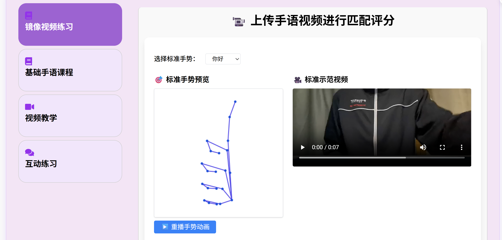
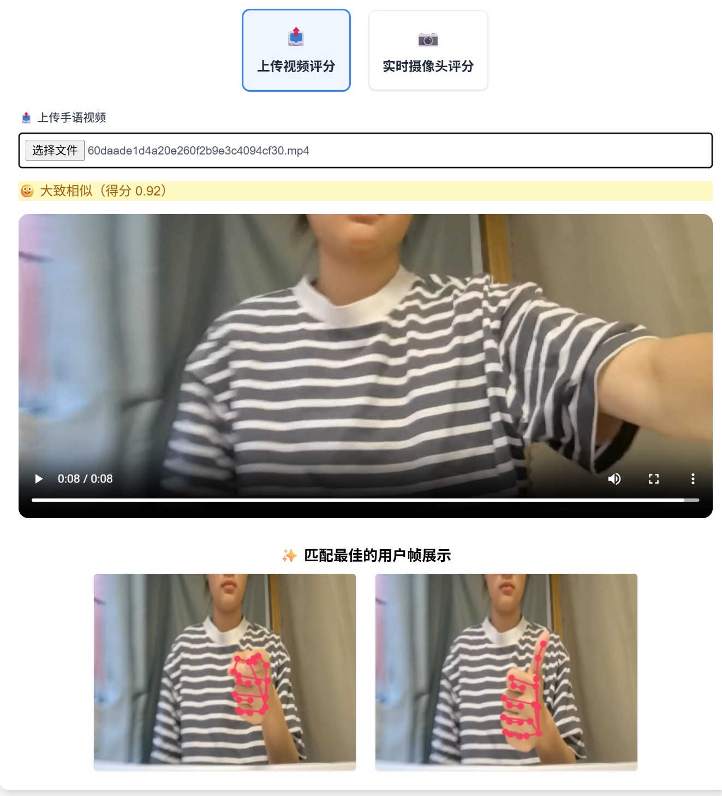

# SignLink 手语通

一个面向听障人群的综合性手语学习与交流平台，集成手语教学、社区互动、生活服务与日程管理等核心功能，致力于提升手语学习体验，增强聋哑用户的社交参与感。

---

## 🧩 项目亮点

- ✋ **手语教学与评分系统**：接入 MediaPipe 实现 21 关键点实时识别、评分、反馈
- 💬 **无障碍社区交流模块**：支持发帖、点赞、评论、关注、收藏等互动功能
- 📅 **日程与待办管理系统**：事件安排+待办清单一体化呈现
- 🎯 **生活辅助服务导航**：出行、好物推荐、就业信息等一站式跳转
- 👤 **个性化个人中心**：支持资料修改、背景上传、我的帖子/收藏/点赞分页显示

---

## 📷 手语识别功能界面预览

本项目使用 MediaPipe 进行手部关键点识别，支持标准手势比对与实时评分反馈。

<p align="center">
  
  &nbsp;
  
</p>

## 🔧 技术栈

| 分类     | 技术选型 |
|----------|----------|
| 前端     | HTML5 + CSS3 + JavaScript + Tailwind CSS + Django Template |
| 后端     | Django 4.x（MTV架构） |
| 数据库   | SQLite3 |
| 手势识别 | MediaPipe Tasks API（hand_landmarker.task） |
| 工具     | VS Code + Git |

---

## 📁 主要模块

- `SLClassroom/`：手语教学模块，支持视频上传或摄像头评分
- `Community/`：社区模块，支持发帖互动
- `Schedule/`：日程模块，记录事件与任务
- `MyPage/`：个人中心，管理用户信息与动态
- `users/`：用户注册登录模块，使用自定义模型 `CustomUser`

---

## 🖼 项目结构

```
SignLink/
├── SignLink/              # 项目主配置
├── users/                 # 用户系统
├── Community/             # 社区模块
├── Schedule/              # 日程管理
├── MyPage/                # 我的页面
├── templates/             # 所有 HTML 页面
├── static/                # 前端静态资源（css/js/img/video/model）
├── media/                 # 用户上传资源（头像、帖子图等）
├── db.sqlite3             # SQLite3 数据库
└── manage.py
```

---

## 🧪 快速启动

### 🔹 创建虚拟环境并激活

```bash
python -m venv venv
venv\Scripts\activate   # Windows
```

### 🔹 安装依赖

```bash
pip install -r requirements.txt
```

### 🔹 启动服务器

```bash
cd SignLink
python manage.py runserver
```

访问： [http://127.0.0.1:8000/](http://127.0.0.1:8000/)

---

## 🚀 项目展望

- ✅ 引入手语语料库，训练自有识别模型
- ✅ 支持连续手势识别与整句评分
- ✅ 丰富手语词库与短语资源包
- ✅ 成就系统、学习可视化等趣味激励机制
- ✅ 接入公益平台资源，推动平台实际应用落地

---

## 🧑‍💻 作者与分工

- **李思妍**：手语教室、个人中心、Mediapipe 接入、后端框架设计、社区联动开发
- **赵一芬**：注册/登录、主页面、日程功能、聊天页面、用户模型开发

---

## 📜 License

本项目为综合设计实验课程成果，未授权使用请联系开发者。
